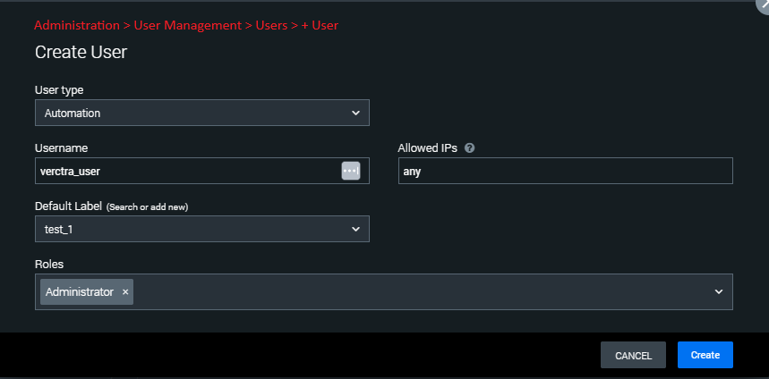
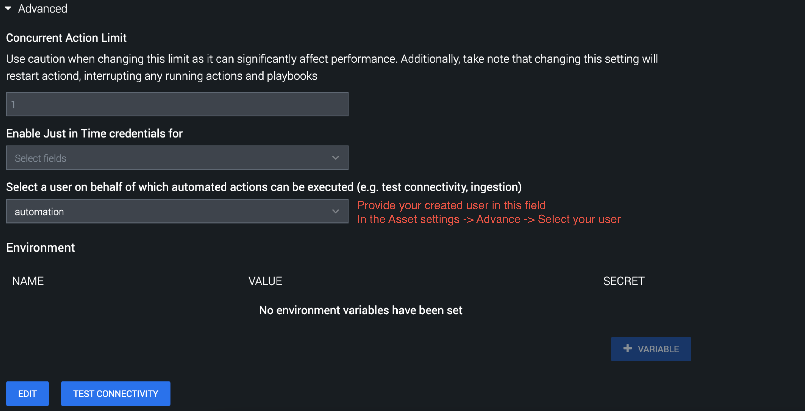

## Explanation of the Asset Configuration Parameters

The asset configuration parameters affect 'test connectivity' and some other actions of the
application. The parameters related to test connectivity action are metioned below.

- **Vectra Base URL:** Base URL of Vectra instance.
- **Client ID:** Client ID.
- **Client Secret:** Client Secret.

## Explanation of the Actions' Parameters

- ### Test Connectivity

  This action will check the status of the Vectra API endpoint and test connectivity of Splunk SOAR
  to the Vectra instance. It can be used to generate new tokens.\
  The action validates the provided asset configuration parameters. Based on the response from the
  API call, the appropriate success and failure message will be displayed when the action gets
  executed.

- ### On Poll

  Polling is to ingest the entity and it's detections and assignments. The user can provide various
  filters for entities and detections.

  ### Prerequisite for On Poll

  - This app should have permission to delete artifact(s)

  - By default, the automation user is selected to run the Vectra XDR for Splunk SOAR ingestion
    action. (See **Asset Configuration** > **Asset Settings** > **Advanced** ) The automation user
    does **NOT** have permission to delete the artifacts. This can cause duplication of detection
    artifacts.

  - In order to solve this problem, you must create a user of type **Automation** with
    **Administrator** role. Then, choose this user in your Vectra XDR for Splunk SOAR **Asset
    Settings** under **Advanced** .

    **Administration** > **User Management** > **Users** **> + User**

    

    **Asset Settings** > **Advanced**

    

  - Make sure severity low, medium, and high is present in soar instance, which comes by default.\
    **NOTE:** To check severity refer this path: **Administration** > **Event Settings** >
    **Severity**

- Manual Polling (POLL NOW)

  - It will fetch the data when initiated, as per the corresponding asset configuration parameters.
    It does not store the last run context of the fetched data.

- **Schedule/Interval Polling**

  - **Schedule Polling:** The ingestion action can be triggered at every specified time interval.
  - **Interval Polling:** The ingestion action can be triggered at every time range interval.
  - It will fetch the data every time, based on the stored context from the previous ingestion run.
    It stores the last run context of the fetched data. It starts fetching data based on the
    combination of the values of stored context for the previous ingestion run.
  - **NOTE:** If the user changes the filter related parameter or stored context while the
    schedule/interval polling is running, then the next polling cycle will start fetching the latest
    data according to the updated configured parameters.

<!-- -->

- **Action Parameter: Poll only prioritized entities**

  - This parameter has three options - True, False and All.
  - If value is set to True then it will fetch those entities which are prioritized.
  - If value is set to False then it will fetch those entities which are not prioritized.
  - If value is set to All then it will fetch all the entities.
  - These parameters are mainly used for additional filtering of entities. If no entity will be
    found with this filter, there would be no detection or assignments ingested.

- **Action Parameter: Entity type (On Poll)**

  - This parameter has three options - Account, Host and All.
  - These parameters are mainly used for additional filtering of entities. If no entity will be
    found with given entity type, there would be no detection or assignments ingested.

- **Action Parameter: Filter entities with given tags (comma-separated) (On Poll)**

  - This parameter accepts comma-separated names of the entity tags.
  - This will filter entities which have any of the given tags.
  - **NOTE:** This asset parameter is case-sensitive and the user must provide the exact case match.

<!-- -->

- **Action Parameter: Filter detection type (On Poll)**

<!-- -->

- This will filter detections with given type.
- These parameters are mainly used for additional filtering of detections. If no detections will be
  found with given filter there would be no detections ingested.
- **NOTE:** This asset parameter is case-sensitive and the user must provide the exact case match.

<!-- -->

- **Action Parameter: Filter detection category (On Poll)**

<!-- -->

- This parameter has these options
  - Command and Control
  - Botnet
  - Reconnaissance
  - Lateral Movement
  - Exfiltration
  - Info
  - All
- These parameters are mainly used for additional filtering of detections. If no detections will be
  found with given filter there would be no detections ingested.

<!-- -->

- **Action Parameter: Set container severity 'low' if entity has equal or less urgency score**

<!-- -->

- If value of entity's urgency score is less or equal to this parameter the container's severity
  will be set to 'low'.
- The default value is 30.

<!-- -->

- **Action Parameter: Set container severity 'medium' if entity has equal or less urgency score**

<!-- -->

- If value of entity's urgency score is less or equal to this parameter the container's severity
  will be set to 'medium'.
- The default value is 50.

<!-- -->

- **Action Parameter: Start time for manual polling and first run of schedule polling(Any valid ISO
  date and time format string)**

<!-- -->

- Schedule polling will start from given date and time. In case of schedule poll, this time will be
  considered for the very first polling cycle only. If the user changes this value after the first
  polling cycle, there won't be any effect as the time stored in state file will be prioritised
  after first polling cycle.
- All entities would be fetched which have 'last_modified_timestamp' greater or equal to given data
  and time.
- Only valid ISO format date and time is allowed. Few examples are 2023-02-02, 2023-07-24T14:13:34Z.
- If value is not given it will fetch past 3 days data from the current time.

<!-- -->

- **Action Parameter: Max entities to ingest for manual polling**

<!-- -->

- Restrict number of container(s) to get ingested for manual poll.

<!-- -->

- **Action Parameter: Max entities to ingest for schedule polling**

<!-- -->

- Restrict number of container(s) to get ingested for schedule poll.

### Add tags

Appends tags on existing tags of an entity

- **Action Parameter: Entity ID**

  - Id of entity

- **Action Parameter: Entity type**

  - Type of entity
  - This parameter has 2 options - Account and Host

- **Action Parameter: Tags list**

  - This parameter accepts comma-separated values for tags to be added

### Remove tags

Removes tags from existing tags of an entity

- **Action Parameter: Entity ID**

  - Id of entity

- **Action Parameter: Entity type**

  - Type of entity
  - This parameter has 2 options - Account and Host

- **Action Parameter: tags list**

  - This parameter accepts comma-separated values for tags to be removed

### Add note

Adds note in specific entity

- **Action Parameter: Entity ID**

  - Id of entity

- **Action Parameter: Entity type**

  - Type of entity
  - This parameter has 2 options - Account and Host

- **Action Parameter: Note**

  - A note to be added in given entity

### Remove note

Removes note in specific entity

- **Action Parameter: Entity ID**

  - Id of entity

- **Action Parameter: Entity type**

  - Type of entity
  - This parameter has 2 options - Account and Host

- **Action Parameter: Note ID**

  - Id of note to be removed

### Update note

Updates note in specific entity

- **Action Parameter: Entity ID**

  - Id of entity

- **Action Parameter: Entity type**

  - Type of entity
  - This parameter has 2 options - Account and Host

- **Action Parameter: Note ID of the note**

  - Note ID

- **Action Parameter: Note**

  - Note to be updated

### Add assignment

Creates assignment for given entity id and user id

- **Action Parameter: Entity ID**

  - Id of entity

- **Action Parameter: Entity type**

  - Type of entity
  - This parameter has 2 options - Account and Host

- **Action Parameter:User ID**

  - User ID for given assignment

### Update assignment

Updated assignment for given assignment id and user id

- **Action Parameter: Assignment ID**

  - Id of assignment

- **Action Parameter:User ID**

  - User ID for given assignment

### Resolve assignment

Resolves assignment of an entity

- **Action Parameter: Outcome**

  - Valid outcome to add as resolution

- **Action Parameter: Note**

  - Note to be added

- **Action Parameter: Triage as**

  - Label for resolution

- **Action Parameter: Detection IDs**

  - Comma separated list of detection ids

- **Action Parameter: Assignment ID**

  - ID of assignment

### Mark entity detections

Be able to mark all detections of an entity as fixed

- **Action Parameter: Entity ID**

  - Id of entity

- **Action Parameter: Entity type**

  - Type of entity
  - This parameter has 2 options - Account and Host

### Mark detection

Mark the status of detection as fixed

- **Action Parameter: Detection ID**

  - Id of detection

### Unmark detection

Unmark the status of detection

- **Action Parameter: Detection ID**

  - Id of detection

### Describe entity

Gets all the details of given entity id

- **Action Parameter: Entity ID**

  - Id of entity

- **Action Parameter: Entity type**

  - Type of entity
  - This parameter has 2 options - Account and Host

### Describe detection

Gets all the details of given detection id

- **Action Parameter: Detection ID**

  - Id of detection

### List entity detections

The action is able to list all active detections present in an entity

- **Action Parameter: Entity ID**

  - Id of entity

- **Action Parameter: Entity type**

  - Type of entity
  - This parameter has 2 options - Account and Host

### Download PCAP

The action is able to download PCAP of a detection

- **Action Parameter: Detection ID**

  - Id of detection
